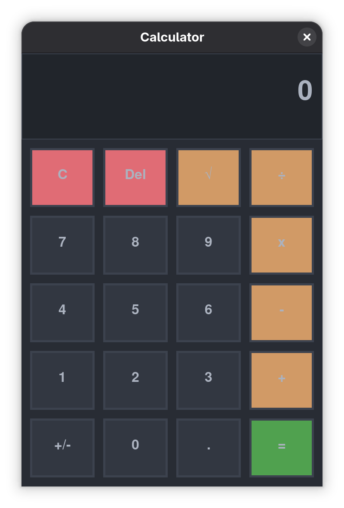
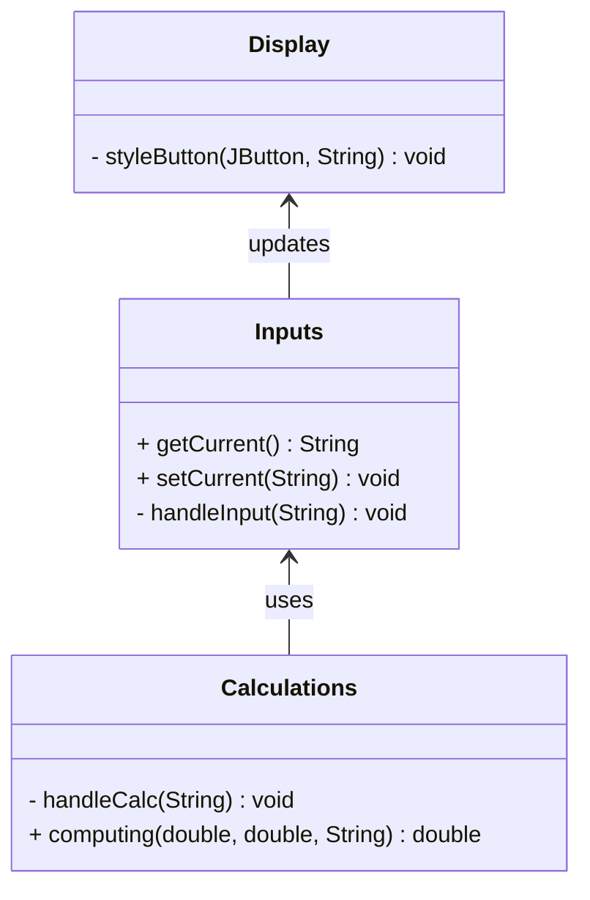

# 🧮 Swing-Calculator
This project is of a simple calculator built using Java Swing to learn and understand the fundamentals of GUI development, using OOP practices to manage and create a clean structure. This project demonstrates basic interface design, event handling, and user interaction by implementing standard calculator operations in a colorfull, clean, functional layout.

---
## Learning Goals

This project was created to:

- Understand Java Swing components  
- Practice event-driven programming  
- Learn how to structure a small GUI application  
- Separate logic, input handling, and presentation

---
## Features
- Basic operations: addition, subtraction, multiplication, division, square-root
- Negative value handling
- Interactive GUI built with Swing
- Button-based input system
- Real-time display updates
- Simple and clean layout (Android style)
- Dark color scheme (One-dark inspired)

---
## Screenshots

---
## Class Diagram

---
## Tech Stack

---

